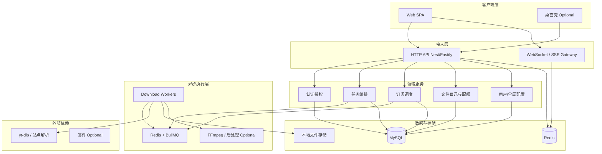

# CodecSiphon — 基于 Node.js 的系统架构设计

> 依据仓库内《视频下载工具 - 功能与 UI 设计》中的业务范围：用户与会话、下载与队列、订阅与定时任务、文件与配额、系统设置与监控等。

## 1. 设计目标与非目标

| 目标 | 说明 |
|------|------|
| 可扩展 | 新增站点适配、处理器类型时不改动核心编排逻辑 |
| 可观测 | 任务进度、 worker 健康、队列积压可查询与告警 |
| 安全 | 多租户数据隔离、最小权限、敏感配置不入库 |
| 异步优先 | 长耗时下载/转码与 HTTP API 解耦 |

| 非目标（初版可搁置） | 说明 |
|----------------------|------|
| 自有对象存储 | 默认本地/NFS；后续可接 S3 兼容存储 |
| 全量多平台桌面打包 | 架构预留 Electron/Tauri 客户端对接同一后端 |

## 2. 逻辑架构（分层）

- **接入层**：RESTful API + JWT（或 Session）认证；任务进度通过 WebSocket 或 SSE 推送（Redis Pub/Sub 或 BullMQ 事件桥接）。
- **领域服务**：围绕「用户、任务、订阅、文件元数据、设置」的业务规则与校验。
- **异步执行层**：所有下载、播放列表展开、合并转封装等放入队列；Worker 水平扩展。
- **外部依赖**：实际拉流与元数据解析推荐 **yt-dlp**（子进程调用）；音视频处理 **FFmpeg**。

## 3. 技术栈选型（推荐）

| 层级 | 推荐选型 | 备选 |
|------|----------|------|
| 运行时 | Node.js LTS（≥20） | — |
| API 框架 | NestJS（模块化 + DI）或 Fastify | Express |
| ORM | Prisma 或 Drizzle | TypeORM |
| 数据库 | MySQL 8+（与 Prisma 迁移一致） | — |
| 缓存/队列 | Redis 7 + BullMQ | Bull（legacy） |
| 实时通道 | Socket.IO / ws + Redis adapter | SSE only |
| 验证 | Zod / class-validator | — |
| 认证 | JWT（Access + Refresh）或 Session + Redis | — |
| 日志 | pino | winston |
| 进程守护（Worker） | PM2 / systemd / K8s Deployment | — |

## 4. 部署拓扑（典型）

**单机一体化（开发/小规模）**

- `api`：1 进程  
- `worker`：1～N 进程（与 CPU/磁盘带宽匹配）  
- `MySQL`、`Redis`：同机或 Docker Compose  

**生产分离**

- API 与 Worker 分 Deployment，Redis/MySQL 托管；对象存储若上云再接 OSS/S3。

## 5. 核心模块职责

### 5.1 API 服务

- 用户注册登录、资料：[注册邮箱验证码](./REGISTER_EMAIL_VERIFICATION_REQUIREMENTS.md)（产品与数据模型占位见该文档）、密码重置（邮件可选）。
- CRUD：下载任务、订阅、文件记录、用户设置。
- **链接解析（URL Extract）**：基于 yt-dlp `-J` + `--flat-playlist` 拉取播放列表/频道类页面的条目（标题、时长、分辨率、发布时间、可复制链接）；`/url-extract/preview-public` 面向未登录引流（条数预览 + 严格 IP 限流），`/url-extract/parse` 面向已登录完整列表（有配置上限）。详见 [URL_EXTRACT.md](URL_EXTRACT.md)。
- **不写长阻塞**：创建任务只入队并返回 `taskId`；进度查询读 DB + 缓存。

### 5.2 Worker 服务

- 消费队列 Job：`PARSE_URL`、`DOWNLOAD_SINGLE`、`DOWNLOAD_PLAYLIST_CHILD`、`POST_PROCESS`、`SUBSCRIPTION_POLL`。
- 调用 yt-dlp：解析标题、格式列表、下载；错误分类（网络、版权、磁盘满）写入任务日志。
- 更新进度：周期性写 Redis（高频）+ 降采样写 MySQL（如每 5% 或每 N 秒）。

### 5.3 订阅调度

- **BullMQ Repeatable Job** 或独立 `scheduler` 进程：按 `cron`/`interval` 触发「检查订阅源 → 对比已下载 → 创建子任务」。
- 需幂等：同一 `(subscription_id, canonical_video_id)` 不重复建任务。

### 5.4 文件与配额

- 物理文件路径规则：`{base}/{userId}/{taskId}/...` 或由「命名模板」生成。
- **配额**：任务完成时累计 `user.storage_used_bytes`；删除文件时扣减；超额拒绝新任务或仅告警（策略可配置）。

### 5.5 实时进度

- 客户端订阅 `task:{id}` 房间；Worker `publish` 进度事件；API Gateway 通过 Redis adapter 广播。

## 6. 安全设计要点

- 密码 **bcrypt/argon2**；JWT 短期 + Refresh 轮转。
- **RBAC**：`admin` / `user`；管理接口单独 Router + Guard。
- **IDOR 防护**：所有任务/文件/订阅查询必须带 `user_id` 条件。
- **URL 与命令注入**：yt-dlp 参数白名单；禁止将用户输入拼接进 shell；使用 `spawn` + 参数数组。
- **速率限制**：登录、创建任务、解析 URL 接口按 IP/用户限流。

## 7. 可观测性

- **结构化日志**：`taskId`、`userId`、`jobId` 贯穿。
- **指标（可选）**：Prometheus — 队列深度、任务成功率、平均耗时、Worker 存活。
- **健康检查**：`/health`（DB + Redis + 磁盘可写）。

## 8. 配置与环境

- 使用 `.env` + 校验（如 `@nestjs/config` + Zod）；**代理、并发数、默认下载目录** 可由「全局默认 + 用户覆盖」合并。
- Worker 与 API 共享同一 schema；Worker 需单独 `DATABASE_URL`、`REDIS_URL`。

## 9. 与功能需求的映射（摘要）

| 功能域 | 架构落点 |
|--------|----------|
| 注册/登录/角色 | Auth 模块 + `users.role` |
| 单视频/批量/播放列表 | 任务类型 + 子任务表或 JSON 规格 |
| 暂停/继续/取消 | 队列 Job 状态机 + Worker 信号 |
| 定时下载 | BullMQ delay / cron |
| 频道订阅 | `subscriptions` + 调度 Job |
| 多分辨率/格式/字幕 | Job `payload.options` + yt-dlp/FFmpeg |
| 链接解析（列表预览/引流） | `/url-extract/*` + yt-dlp；设计见 [URL_EXTRACT.md](URL_EXTRACT.md) |
| 下载历史/搜索 | `download_tasks` + `media_files` 索引 |
| 存储配额 | 用户表累计字段 + 完成钩子 |
| 系统监控 | 指标 + 管理 API |

## 10. 演进路线（建议顺序）

1. 用户认证 + 任务 CRUD + 单 Worker + MySQL + Redis + BullMQ。  
2. WebSocket 进度 + 播放列表子任务。  
3. 订阅调度 + 配额。  
4. FFmpeg 后处理与字幕嵌入。  
5. 多 Worker 与监控告警。

---

*文档版本：与功能说明文档对齐的初版架构；实施时可按团队栈微调框架选型。*
