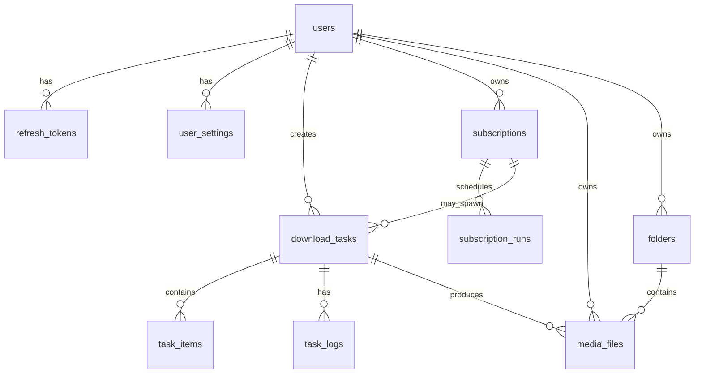

# CodecSiphon — 数据库设计文档

> 关系型数据库：**MySQL**（与 `backend/prisma/schema.prisma` 一致）。命名：`snake_case`；主键：UUID（由应用或 DB 生成）等，以 **UUID** 为例便于分布式扩展。

## 1. ER 概览



## 2. 枚举类型（MySQL / Prisma `enum`）

```sql
CREATE TYPE user_role AS ENUM ('user', 'admin');

CREATE TYPE task_status AS ENUM (
  'pending', 'queued', 'parsing', 'downloading',
  'processing', 'completed', 'paused', 'cancelled', 'failed'
);

CREATE TYPE task_source_type AS ENUM (
  'single_url', 'multi_url', 'playlist', 'subscription'
);

CREATE TYPE subscription_type AS ENUM ('channel', 'playlist', 'rss');

CREATE TYPE subscription_status AS ENUM ('active', 'paused');
```

（若偏好简单演进，可将 ENUM 改为 `TEXT` + CHECK 约束。）

## 3. 表结构定义

### 3.1 `users` — 用户

| 列名 | 类型 | 约束 | 说明 |
|------|------|------|------|
| id | UUID | PK | |
| email | VARCHAR(255) | UNIQUE NOT NULL | 登录账号 |
| password_hash | VARCHAR(255) | NOT NULL | |
| display_name | VARCHAR(100) | | 展示名 |
| role | user_role | NOT NULL DEFAULT 'user' | |
| storage_quota_bytes | BIGINT | NOT NULL DEFAULT 1073741824 | 缺省存储上限（可由注册逻辑/env 改写；历史库以迁移为准） |
| storage_used_bytes | BIGINT | NOT NULL DEFAULT 0 | 冗余字段，便于快速校验 |
| monthly_download_quota_bytes | BIGINT | NOT NULL DEFAULT 5368709120 | 单月出站下载配额上限（字节；计量接入前仅占位） |
| email_verified_at | TIMESTAMPTZ | | |
| created_at | TIMESTAMPTZ | NOT NULL DEFAULT now() | |
| updated_at | TIMESTAMPTZ | NOT NULL DEFAULT now() | |

索引：`UNIQUE(email)`。

### 3.2 `refresh_tokens` — 刷新令牌（可选，若用 JWT Refresh）

| 列名 | 类型 | 约束 | 说明 |
|------|------|------|------|
| id | UUID | PK | |
| user_id | UUID | FK → users(id) ON DELETE CASCADE | |
| token_hash | VARCHAR(64) | UNIQUE NOT NULL | 仅存哈希 |
| expires_at | TIMESTAMPTZ | NOT NULL | |
| created_at | TIMESTAMPTZ | NOT NULL DEFAULT now() | |

索引：`(user_id)`，`UNIQUE(token_hash)`。

### 3.3 `user_settings` — 用户级设置（键值或单列 JSON）

**方案 A（推荐）**：单行 JSONB，便于扩展。

| 列名 | 类型 | 约束 | 说明 |
|------|------|------|------|
| user_id | UUID | PK, FK → users(id) ON DELETE CASCADE | |
| preferences | JSONB | NOT NULL DEFAULT '{}' | 主题、语言、默认质量等 |
| download_defaults | JSONB | NOT NULL DEFAULT '{}' | 默认路径模板、并发、代理等 |
| updated_at | TIMESTAMPTZ | NOT NULL DEFAULT now() | |

`download_defaults` 示例键：`default_download_path`, `max_concurrent_tasks`, `proxy_url`, `filename_template`。

### 3.4 `global_settings` — 系统级配置（管理员）

| 列名 | 类型 | 约束 | 说明 |
|------|------|------|------|
| key | VARCHAR(64) | PK | |
| value | JSONB | NOT NULL | |
| updated_at | TIMESTAMPTZ | NOT NULL DEFAULT now() | |

用于：全局并发上限、维护模式、允许的域名白名单等。

### 3.5 `folders` — 用户虚拟目录（文件分类）

| 列名 | 类型 | 约束 | 说明 |
|------|------|------|------|
| id | UUID | PK | |
| user_id | UUID | FK → users(id) ON DELETE CASCADE NOT NULL | |
| parent_id | UUID | FK → folders(id) ON DELETE CASCADE | 根目录为 NULL |
| name | VARCHAR(255) | NOT NULL | |
| path | TEXT | NOT NULL | 物化路径如 `/Videos/Youtube`，便于查询 |
| created_at | TIMESTAMPTZ | NOT NULL DEFAULT now() | |

索引：`UNIQUE(user_id, path)`（path 规范化后）。

### 3.6 `download_tasks` — 下载任务（主任务）

| 列名 | 类型 | 约束 | 说明 |
|------|------|------|------|
| id | UUID | PK | |
| user_id | UUID | FK → users(id) ON DELETE CASCADE NOT NULL | |
| subscription_id | UUID | FK → subscriptions(id) ON DELETE SET NULL | 来自订阅时填充 |
| source_type | task_source_type | NOT NULL | |
| status | task_status | NOT NULL DEFAULT 'pending' | |
| source_url | TEXT | | 主 URL |
| source_urls | TEXT[] | | 批量时多个 |
| title | TEXT | | 解析后标题 |
| platform | VARCHAR(64) | | youtube/bilibili 等 |
| options | JSONB | NOT NULL DEFAULT '{}' | 质量、格式、字幕、命名模板等 |
| progress_percent | SMALLINT | NOT NULL DEFAULT 0 | 0–100，聚合或主进度 |
| bytes_downloaded | BIGINT | NOT NULL DEFAULT 0 | |
| bytes_total | BIGINT | | 未知可为 NULL |
| speed_bytes_per_sec | INTEGER | | 可选，展示用 |
| error_code | VARCHAR(64) | | |
| error_message | TEXT | | |
| scheduled_at | TIMESTAMPTZ | | 定时任务触发时间 |
| started_at | TIMESTAMPTZ | | |
| completed_at | TIMESTAMPTZ | | |
| created_at | TIMESTAMPTZ | NOT NULL DEFAULT now() | |
| updated_at | TIMESTAMPTZ | NOT NULL DEFAULT now() | |

索引：

- `(user_id, status, created_at DESC)` — 任务列表筛选。
- `(user_id, created_at DESC)` — 历史时间序。
- `GIN(source_urls)` — 若需按 URL 查重（可选）。

### 3.7 `task_items` — 子任务（播放列表项 / 批量中单条）

| 列名 | 类型 | 约束 | 说明 |
|------|------|------|------|
| id | UUID | PK | |
| task_id | UUID | FK → download_tasks(id) ON DELETE CASCADE NOT NULL | |
| item_index | INTEGER | NOT NULL |  playlist 中顺序 |
| canonical_id | VARCHAR(128) | | 站点唯一视频 ID，幂等用 |
| item_url | TEXT | NOT NULL | |
| title | TEXT | | |
| status | task_status | NOT NULL DEFAULT 'pending' | |
| progress_percent | SMALLINT | NOT NULL DEFAULT 0 | |
| media_file_id | UUID | FK → media_files(id) ON DELETE SET NULL | 完成后关联 |
| error_message | TEXT | | |
| created_at | TIMESTAMPTZ | NOT NULL DEFAULT now() | |
| updated_at | TIMESTAMPTZ | NOT NULL DEFAULT now() | |

索引：

- `UNIQUE(task_id, item_index)`。
- `UNIQUE(task_id, canonical_id)`（canonical_id 非空时，可用 partial unique index）。

### 3.8 `task_logs` — 任务日志行（操作审计 / 详情页日志）

| 列名 | 类型 | 约束 | 说明 |
|------|------|------|------|
| id | BIGSERIAL | PK | |
| task_id | UUID | FK → download_tasks(id) ON DELETE CASCADE NOT NULL | |
| level | VARCHAR(16) | NOT NULL | info/warn/error |
| message | TEXT | NOT NULL | |
| meta | JSONB | | 原始 yt-dlp 片段等 |
| created_at | TIMESTAMPTZ | NOT NULL DEFAULT now() | |

索引：`(task_id, id DESC)`。

（大数据量时可按时间分区或异步归档到对象存储。）

### 3.9 `media_files` — 下载产物元数据

| 列名 | 类型 | 约束 | 说明 |
|------|------|------|------|
| id | UUID | PK | |
| user_id | UUID | FK → users(id) ON DELETE CASCADE NOT NULL | |
| task_id | UUID | FK → download_tasks(id) ON DELETE SET NULL | |
| folder_id | UUID | FK → folders(id) ON DELETE SET NULL | |
| file_name | VARCHAR(512) | NOT NULL | |
| relative_path | TEXT | NOT NULL | 相对用户根存储的路径 |
| mime_type | VARCHAR(128) | | |
| size_bytes | BIGINT | NOT NULL | |
| duration_sec | INTEGER | | |
| width | INTEGER | | |
| height | INTEGER | | |
| checksum_sha256 | VARCHAR(64) | | 可选 |
| metadata | JSONB | NOT NULL DEFAULT '{}' | 编码、码率等 |
| created_at | TIMESTAMPTZ | NOT NULL DEFAULT now() | |

索引：

- `(user_id, created_at DESC)` — 文件列表。
- `(user_id, file_name)` — 搜索（配合 `pg_trgm` 可做模糊，可选）。

### 3.10 `subscriptions` — 频道/列表订阅

| 列名 | 类型 | 约束 | 说明 |
|------|------|------|------|
| id | UUID | PK | |
| user_id | UUID | FK → users(id) ON DELETE CASCADE NOT NULL | |
| type | subscription_type | NOT NULL | |
| source_url | TEXT | NOT NULL | |
| display_name | VARCHAR(255) | | 解析后的名称 |
| status | subscription_status | NOT NULL DEFAULT 'active' | |
| check_interval_sec | INTEGER | NOT NULL DEFAULT 21600 | 例如 6 小时 |
| download_options | JSONB | NOT NULL DEFAULT '{}' | 与任务 options 结构对齐 |
| filter_rules | JSONB | NOT NULL DEFAULT '{}' | 标题/时长/大小过滤 |
| notify_email | BOOLEAN | NOT NULL DEFAULT false | |
| notify_desktop | BOOLEAN | NOT NULL DEFAULT false | |
| last_checked_at | TIMESTAMPTZ | | |
| last_item_published_at | TIMESTAMPTZ | | 用于增量 |
| created_at | TIMESTAMPTZ | NOT NULL DEFAULT now() | |
| updated_at | TIMESTAMPTZ | NOT NULL DEFAULT now() | |

索引：`(user_id, status)`。

### 3.11 `subscription_runs` — 每次检查记录（可选，便于排障）

| 列名 | 类型 | 约束 | 说明 |
|------|------|------|------|
| id | BIGSERIAL | PK | |
| subscription_id | UUID | FK → subscriptions(id) ON DELETE CASCADE NOT NULL | |
| started_at | TIMESTAMPTZ | NOT NULL DEFAULT now() | |
| finished_at | TIMESTAMPTZ | | |
| new_tasks_created | INTEGER | NOT NULL DEFAULT 0 | |
| error_message | TEXT | | |

索引：`(subscription_id, id DESC)`。

### 3.12 `registration_email_codes` — 注册邮箱 OTP

注册完成**前**校验邮箱用；与 `password_reset_tokens` **分表**，避免令牌类型混淆。实现与产品规则见 [REGISTER_EMAIL_VERIFICATION_REQUIREMENTS.md](./REGISTER_EMAIL_VERIFICATION_REQUIREMENTS.md)。

| 列名 | 类型 | 约束 | 说明 |
|------|------|------|------|
| id | UUID | PK | |
| email | VARCHAR(255) | NOT NULL | 规范化小写邮箱；**无外键**——此时可能尚无 `users` 行 |
| code_hash | VARCHAR(64) | NOT NULL | 仅存 OTP 的哈希（明文不落库） |
| expires_at | DATETIME(3) | NOT NULL | 过期后不可核销 |
| verify_attempts | INT | NOT NULL DEFAULT 0 | 校验失败递增；达上限拒绝核销（防爆破） |
| used_at | DATETIME(3) | | 核销成功写入；`NULL` 表示未消费 |
| created_at | DATETIME(3) | NOT NULL DEFAULT now() | |

索引：`(email, created_at DESC)`——按邮箱取最新可用码、批量清理。

### 3.13 `password_reset_tokens` — 忘记密码

| 列名 | 类型 | 约束 | 说明 |
|------|------|------|------|
| id | UUID | PK | |
| user_id | UUID | FK → users(id) ON DELETE CASCADE NOT NULL | |
| token_hash | VARCHAR(64) | UNIQUE NOT NULL | 仅存哈希 |
| expires_at | DATETIME(3) | NOT NULL | |
| used_at | DATETIME(3) | | 一次性使用 |
| created_at | DATETIME(3) | NOT NULL DEFAULT now() | |

索引：`(user_id, created_at DESC)`。

需求与流程见 [PASSWORD_RESET_REQUIREMENTS.md](./PASSWORD_RESET_REQUIREMENTS.md)、技术设计见 [PASSWORD_RESET_TECH_DESIGN.md](./PASSWORD_RESET_TECH_DESIGN.md)。

## 4. 数据一致性与业务规则

1. **storage_used_bytes**：在 `media_files` 插入/删除时事务内更新 `users`，或使用触发器；防止并发漂移建议「重算任务」定期校验。
2. **任务状态**：主任务 `download_tasks.status` 可由子任务聚合（全部成功→completed，任一失败策略：fail-fast 或 partial）。
3. **幂等**：`task_items.canonical_id` + `UNIQUE` 避免订阅重复建任务。
4. **软删除**：若需回收站，为 `media_files`、`download_tasks` 增加 `deleted_at` 索引字段。

## 5. 与 BullMQ 的关系

- 队列 Job 的 `jobId` 建议设为 `task_id` 或 `task_id:phase`，数据库仍以 `download_tasks` 为权威状态。
- Worker 崩溃时通过「超时检测」将 `downloading` 置为 `failed` 或重新入队（需结合业务）。

## 6. 初始迁移顺序建议

1. ENUM / users  
2. user_settings、refresh_tokens、`password_reset_tokens`、`registration_email_codes`  
3. folders  
4. subscriptions、subscription_runs  
5. download_tasks、task_items、task_logs  
6. media_files（外键依赖 tasks）  
7. global_settings  

---

*表字段可根据首版范围删减（例如先做单 URL、不做 folders）。*
