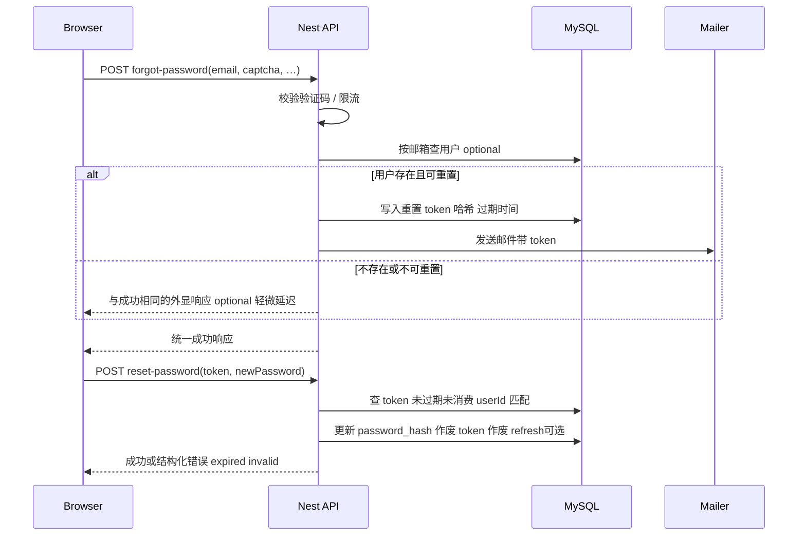

# 用户站 — 忘记密码 / 邮箱找回（技术设计）

**需求溯源：[PASSWORD_RESET_REQUIREMENTS.md](./PASSWORD_RESET_REQUIREMENTS.md)**。  
本文约定 API、数据模型、安全与前端路由；实现时以代码与迁移为最终口径。

---

## 1. 总体流程

---

## 2. API 草案（`/auth` 命名空间）

> 与方法名最终实现一致即可；建议使用 **动词资源**避免与 REST 名词冲突。

| 方法 | 路径 | 说明 |
|------|------|------|
| `POST` | `/auth/forgot-password` | 提交邮箱 + **图形验证码**（与 [`LoginDto`](../backend/src/auth/dto/login.dto.ts) 中 captcha 字段对齐或子集）。返回体**恒为同一形状**（见 §6）。 |
| `POST` | `/auth/reset-password` | Body：`token`（或 `token` + `email` 联合校验，推荐带 email 缩短暴力空间）、`newPassword`、`confirmPassword`（或仅服务端校验一次）。成功后 **204** 或 **`{ ok: true }`**。 |
| （可选） | `GET` | 不写敏感操作在 GET；**重置落地页可用前端路由**，token 仅存于 SPA query/hash，再用 POST 提交。 |

**管理端**：不在本期；若未来需要，`POST /admin/auth/forgot-password` 必须独立限流与安全审计，且不与本节混用令牌表。

---

## 3. 数据模型（Prisma / MySQL）

与 [DATABASE_DESIGN.md](./DATABASE_DESIGN.md) §3.13 一致，建议单独表 **`password_reset_tokens`**（或统一 `user_security_tokens`，首期独立表更清晰）：

| 列 | 类型 | 说明 |
|----|------|------|
| `id` | UUID PK | |
| `user_id` | UUID FK → `users.id` ON DELETE CASCADE | |
| `token_hash` | CHAR(64) UNIQUE | SHA-256(hex) **明文令牌**不在库保存 |
| `expires_at` | DATETIME(3) | 建议 **15～60 分钟**（实现时取固定配置） |
| `used_at` | DATETIME(3) NULL | 非空表示已消费 |
| `created_at` | DATETIME(3) | |
| IP / user_agent | 可选 VARCHAR | 审计排障 |

**索引**：`(user_id, created_at)` 便于限速与清理；`token_hash` UNIQUE。

**令牌生成**：`resetTokenPlain = randomBytes(32).hex`（或 JWT 不推荐：过长且核验需额外密钥旋转策略）；邮件链接形如：  
`{FRONTEND_URL}/reset-password?token={plain}` （或 `/:locale/reset-password?…`）。

**同一用户多条记录**：允许；**消费旧 token**：新申请可使旧记录仍有效仅在「未过期且未使用」语义下先到先得，或可选「签发时吊销该用户其他未使用的 token」——推荐 **单次仅一条有效**：每次 `forgot-password` 将同一 `user_id` 的未使用记录 `used_at=now()` 或删除，简化心理模型。

---

## 4. 服务端逻辑要点

### 4.1 `forgot-password`

1. **Captcha**：复用 [`CaptchaService`](../backend/src/auth/captcha.service.ts) verify（与登录一致），防机器人刷邮件。  
2. **Normalize email**：小写、`trim`。  
3. **限流**：  
   - 每 IP：`N` 次 / 小时（配置项）；  
   - 每邮箱：`M` 次 / 小时（配置项，`M ≤ N`）。  
   可用 Redis（若已有）、或依赖现有 `SecurityModule` 的中间件——与项目现状对齐。  
4. **查找用户**：`email` 匹配；若 **`is_active === false`**：不发送邮件，**响应与成功一致**。  
5. **若不存在**：同上。  
6. **可选常量时间**：对上述分支做 **`setTimeout`/短暂忙等**（10～50ms 量级）弱化时序枚举（量力而行）。  
7. **写入 token + 发送邮件**：异步发送时注意 Nest 生命周期；发送失败：**仍返回统一成功**，**打日志**。  
8. **防邮件轰炸**：即使有 captcha + 限流，仍须在运维层监控异常 IP。

### 4.2 `reset-password`

1. **`token_hash`** = `SHA-256(plainToken)`，`findUnique({ token_hash })`。  
2. 校验：**未过期**、`used_at` 为空、`user` 仍存在且 **`is_active === true`**（否则返回 **400/401** 泛化 `"无效或已过期的重置链接"`，不拆分原因）。  
3. **密码**：bcrypt（与 [`AuthService`](../backend/src/auth/auth.service.ts) 注册一致，`BCRYPT_ROUNDS` 复用）。  
4. **事务**：  
   - 更新 `users.password_hash`；  
   - 将该 token（或全部该用户未完成 token）标记 `used_at`；  
   - **建议**：删除或失效该用户 **`refresh_tokens`** 表中 `audience = user` 的记录，强制重新登录。

### 4.3 与现有 JWT / 会话

- Access JWT 仍可短期有效；为简化，**仅靠 refresh 废除**可降低实现成本；若要「立即踢下线」需服务端黑名单——**首期不做**。  
- 明确要求：见需求 **B-04**。

---

## 5. 邮件发送（SMTP）

| 配置项（`.env` 示例） | 说明 |
|---------------------|------|
| `SMTP_HOST` / `SMTP_PORT` / `SMTP_SECURE` | 直连 SMTP |
| `SMTP_USER` / `SMTP_PASS` | 认证 |
| `MAIL_FROM` | `From:` 抬头 |
| `APP_PUBLIC_URL` 或沿用 `FRONTEND_URL` | 拼重置链接前缀 |

推荐使用 **`nodemailer`** 或与现有栈一致的库；封装 `MailModule`/`MailService`，**单元测试可用 Ethereal/Ethereal trap**。

**模板**：站内 HTML + 纯文本 fallback；令牌只出现一次。

---

## 6. HTTP 契约与错误码

### 6.1 `POST /auth/forgot-password`

- **请求**（示例）：`{ "email": "u@example.com", "captchaId": "...", "captchaCode": "..." }`。  
- **响应（任意合法邮箱均为 200）**：`{ "ok": true }`（勿含 `sent`、`exists`）。

业务错误仅限：

- **400**：验证码错误 / 校验失败 body（与登录类似）。  
- **429**：限流。

### 6.2 `POST /auth/reset-password`

- **请求**：`{ "token": "<plain-from-email>", "newPassword": "..." }`。  
- **200 / 204**：成功。  
- **400**：弱密码、令牌无效或已过期、已使用（文案统一）。

---

## 7. 前端（Vue SPA）

| 项 | 建议 |
|----|------|
| **路由** | `/reset-password`，query `token`；无 token 时可展示「请先通过邮件链接进入」 |
| **登录页** | 增加链接至 `/forgot-password`（或与登录同布局的嵌入式步骤） |
| **忘记密码页** | 表单：邮箱 + 验证码组件（复用 `LoginView`/公共组件） |
| **提交后** | 提示「若邮箱已注册将收到邮件」（防枚举话术统一口径） |

**i18n**：`locales/*/auth.ts`（或等价）新增键名。

---

## 8. 测试与运维

| 类型 | 内容 |
|------|------|
| **单测** | token 哈希、过期、单次消费、inactive 用户、不存在用户均为统一 forgot 响应形状。 |
| **E2E** | 可选用 Mailhog / Mailpit docker 收件验证链接。 |
| **清理任务**（可选 cron） | 删除 `expires_at < now()` 的记录，减少表膨胀。 |

---

## 9. 实现检查清单（给开发）

- [ ] Prisma migration：`password_reset_tokens`  
- [ ] `AuthModule`：`ForgotPasswordDto` / `ResetPasswordDto`  
- [ ] `AuthController` 两 POST 端点 + 限流 + Captcha  
- [ ] `MailService`（或队列异步）  
- [ ] `DATABASE_DESIGN.md` §3.13 与 `schema.prisma` 对齐说明  
- [ ] `README` 或 `.env.example`：`SMTP_*` 与前端 `FRONTEND_URL`  
- [ ] 前端页面与路由、i18n  

---

## 10. 风险与备选

| 风险 | 缓解 |
|------|------|
| 邮箱延迟 / 垃圾箱 | 产品文案 + SMTP SPF/DKIM 运维文档 |
| 泄露重置链接 | 短 TTL + HTTPS + HttpOnly**不适用 SPA query**——避免把 token 存 localStorage：仅用 URL → POST 后即丢弃 |
| 与 ADMIN_MODULE 令牌体系混淆 | 重置仅走 `password_reset_tokens`，**不**共用 refresh/access |

---

*本文档为实现蓝本；落地后建议在 `CHANGELOG` 或 `ARCHITECTURE.md`「认证」小节补一行索引。*
