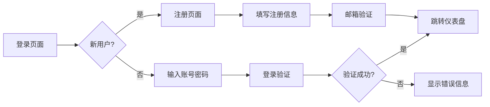
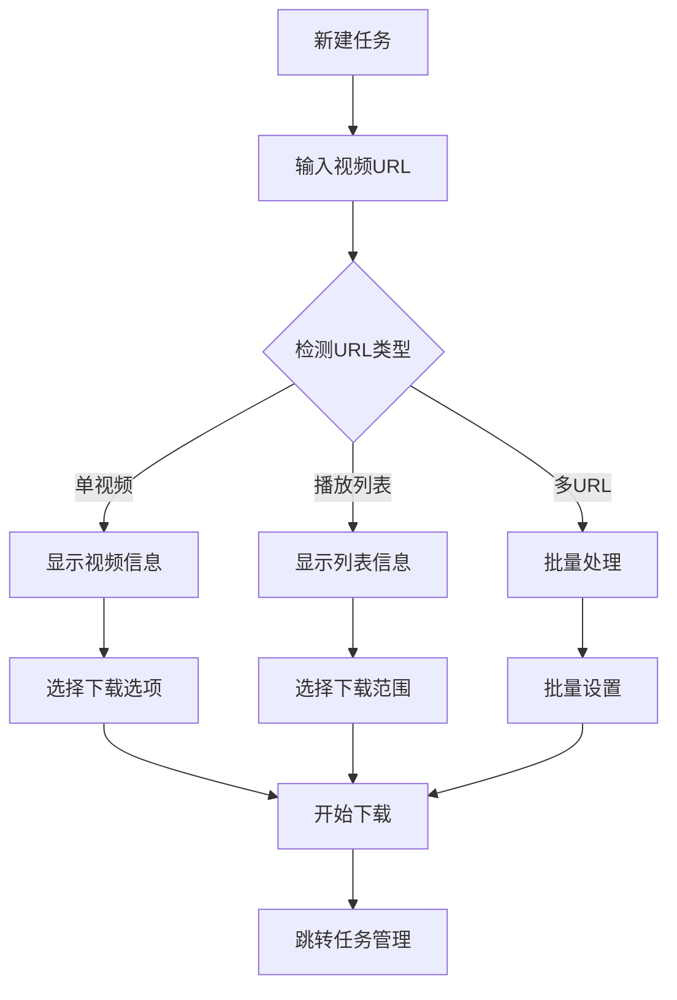
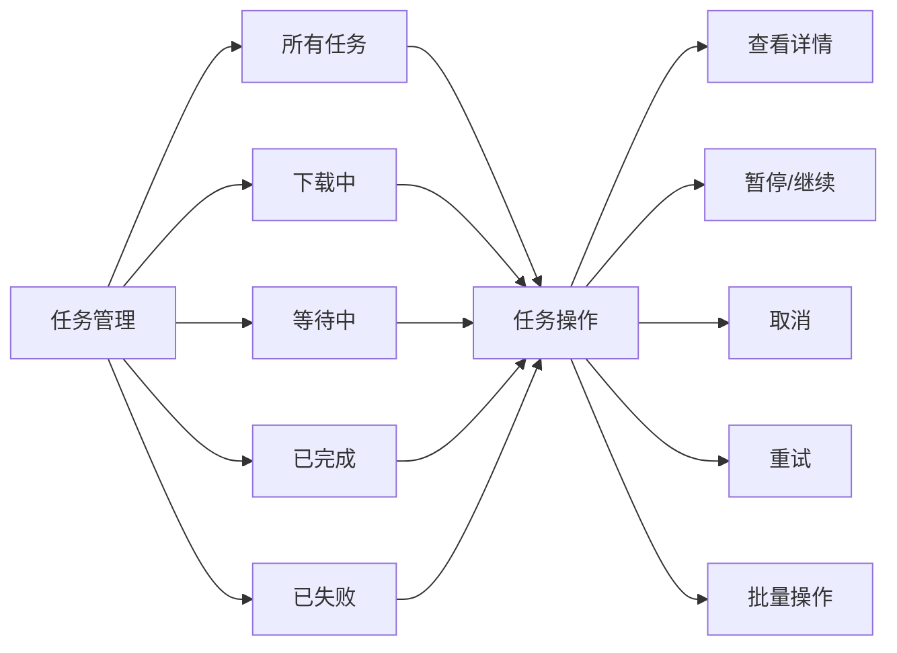
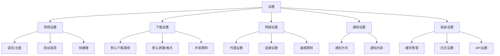

# 视频下载工具 - 功能与UI设计

## 一、核心功能设计

### 1. 用户管理功能
```
用户管理：
- 注册/登录/登出
- 个人资料管理
- 密码修改/重置
- 用户角色（管理员/普通用户）
- 会话管理
```

### 2. 下载功能
```
下载管理：
- 单视频下载
- 批量URL下载
- 播放列表下载
- 频道订阅自动下载
- 定时下载任务
- 暂停/继续/取消下载
```

### 3. 视频处理
```
视频处理：
- 多分辨率选择
- 多格式输出（MP4, MKV, WebM）
- 音视频格式转换
- 字幕下载与嵌入
- 视频合并/分割
- 元数据编辑
```

### 4. 文件管理
```
文件管理：
- 下载历史查看
- 文件分类管理
- 搜索与筛选
- 批量操作（删除/导出）
- 存储配额管理
- 文件预览
```

### 5. 系统功能
```
系统管理：
- 全局设置
- 下载路径配置
- 网络代理设置
- 并发数控制
- 任务队列管理
- 系统监控
```

## 二、用户界面设计

### 1. 整体布局
```
布局结构：
┌─────────────────────────────────────────────────────────────┐
│ ┌────────────────┐  ┌─────────────────────────────────────┐ │
│ │                │  │                                     │ │
│ │    Sidebar     │  │            Main Content            │ │
│ │                │  │                                     │ │
│ │  • 仪表盘       │  │                                     │ │
│ │  • 新建任务     │  │  ┌─────────────────────────────┐  │ │
│ │  • 任务管理     │  │  │                             │  │ │
│ │  • 文件管理     │  │  │   当前页面主要内容区        │  │ │
│ │  • 订阅管理     │  │  │                             │  │ │
│ │  • 设置         │  │  └─────────────────────────────┘  │ │
│ │  • 帮助         │  │                                     │ │
│ └────────────────┘  └─────────────────────────────────────┘ │
└─────────────────────────────────────────────────────────────┘
```

### 2. 页面设计详情

#### 2.1 登录/注册页面


界面设计：
```
登录页面：
┌─────────────────────────────────────┐
│        🎬 视频下载工具              │
├─────────────────────────────────────┤
│  📧 邮箱: [______________________]  │
│  🔐 密码: [______________________]  │
│                                     │
│  [✅ 记住我]  [❓ 忘记密码?]         │
│                                     │
│        [🚀 登录]                    │
│                                     │
│  ───────── 或 ──────────            │
│                                     │
│        [📝 注册新账户]              │
└─────────────────────────────────────┘

注册页面：
┌─────────────────────────────────────┐
│            用户注册                  │
├─────────────────────────────────────┤
│  👤 用户名: [____________________]  │
│  📧 邮箱:   [____________________]  │
│  🔐 密码:   [____________________]  │
│  🔁 确认密码:[____________________]  │
│  📱 验证码:  [____] [发送验证码]     │
│                                     │
│  [✓] 我已阅读并同意服务条款         │
│                                     │
│        [✅ 注册]     [↩️ 返回登录]  │
└─────────────────────────────────────┘
```

#### 2.2 仪表盘页面
```
仪表盘布局：
┌─────────────────────────────────────────────────────────────────────┐
│ 导航栏 [Logo] 搜索框 [用户头像▼] 通知🔔 设置⚙️ 登出                 │
├─────────────────────────────────────────────────────────────────────┤
│ ┌─侧边栏────────────────┐ ┌─主要内容区──────────────────────────────┐ │
│ │ 📊 仪表盘             │ │                                        │ │
│ │ 📥 新建任务           │ │  🔥 欢迎回来，用户名！                 │ │
│ │ 📋 任务管理           │ │                                        │ │
│ │ 📁 文件管理           │ │  ┌─快速操作──────────┐                   │ │
│ │ 📰 订阅管理           │ │  │ [📥 新建下载任务]  │                   │ │
│ │ ⚙️ 设置              │ │  │ [📁 查看下载历史]  │                   │ │
│ │ ❓ 帮助              │ │  └──────────────────┘                   │ │
│ │                      │ │                                        │ │
│ │ 存储使用情况:         │ │  ┌─系统状态──────────┐                   │ │
│ │  ███████░░░░ 75%     │ │  │ CPU:  ▮▮▮▮▯ 40%   │                   │ │
│ │  75GB / 100GB        │ │  │ 内存: ▮▮▮▯▯ 60%   │                   │ │
│ │                      │ │  │ 磁盘: ▮▮▮▮▯ 80%   │                   │ │
│ │ 今日下载: 5个文件     │ │  │ 网络: ▮▮▯▯▯ 2MB/s │                   │ │
│ │ 总文件数: 128个       │ │  └──────────────────┘                   │ │
│ └──────────────────────┘ │                                        │ │
│                          │  ┌─最近任务───────────┐                   │ │
│                          │  │ ID    进度   状态  │                   │ │
│                          │  │ 001   85%    ▮▮▮▮▯ │                   │ │
│                          │  │ 002   100%   ✅    │                   │ │
│                          │  │ 003   45%    ▮▮▯▯▯ │                   │ │
│                          │  │ 004   失败   ❌    │                   │ │
│                          │  └───────────────────┘                   │ │
└─────────────────────────────────────────────────────────────────────┘
```

#### 2.3 新建任务页面


界面设计：
```
新建任务页面 - 单视频模式：
┌─────────────────────────────────────────────────────────────────┐
│ 新建下载任务                                                      │
├─────────────────────────────────────────────────────────────────┤
│ 步骤1: 输入视频链接                                                │
│ ┌─────────────────────────────────────────────────────────────┐ │
│ │ https://www.youtube.com/watch?v=xxxxxxxxxxx                │ │
│ └─────────────────────────────────────────────────────────────┘ │
│ [🔍 检测链接]  [📋 从剪贴板粘贴]  [📁 导入文本文件]                  │
│                                                                  │
│ 步骤2: 视频信息 (检测后显示)                                       │
│ ┌─────────────────────────────────────────────────────────────┐ │
│ │ 标题: 【4K】超美风景视频 - 自然风光欣赏                          │ │
│ │ 时长: 15:30 | 作者: NatureTV | 发布时间: 2024-01-15           │ │
│ │ 封面: [缩略图预览]                                             │ │
│ └─────────────────────────────────────────────────────────────┘ │
│                                                                  │
│ 步骤3: 下载设置                                                   │
│ ┌─视频质量──────────────┐ ┌─输出格式────────────┐                │
│ │ ○ 自动选择 (最佳)     │ │ ○ MP4 (推荐)       │                │
│ │ ○ 2160p (4K)         │ │ ○ MKV             │                │
│ │ ○ 1080p              │ │ ○ WebM           │                │
│ │ ○ 720p               │ │ ○ 仅音频         │                │
│ │ ○ 480p               │ │ ○ 仅视频         │                │
│ └──────────────────────┘ └───────────────────┘                │
│                                                                  │
│ ┌─高级选项─────────────────────────────────────────────────────┐ │
│ │ [✓] 下载字幕 (自动选择: 中文) [选择语言▽]                      │ │
│ │ [✓] 嵌入元数据                                                  │ │
│ │ [ ] 下载封面图                                                  │ │
│ │ 输出文件夹: [~/Downloads/Videos/] [浏览...]                   │ │
│ │ 文件名模板: [%title%] [预设模板▽]                             │ │
│ └───────────────────────────────────────────────────────────────┘ │
│                                                                  │
│                          [⬅️ 上一步] [开始下载 ➡️]                │
└─────────────────────────────────────────────────────────────────┘

新建任务页面 - 批量模式：
┌─────────────────────────────────────────────────────────────────┐
│ 批量下载任务                                                      │
├─────────────────────────────────────────────────────────────────┤
│ 模式: ○ 单视频  ● 播放列表  ○ 多链接                              │
│                                                                  │
│ 播放列表URL:                                                     │
│ ┌─────────────────────────────────────────────────────────────┐ │
│ │ https://www.youtube.com/playlist?list=xxxxxxx               │ │
│ └─────────────────────────────────────────────────────────────┘ │
│                                                                  │
│ 下载范围:                                                        │
│ ┌─选择范围──────────────┐ ┌─过滤选项──────────────┐               │
│ │ ○ 全部视频            │ │ [✓] 仅下载新视频       │               │
│ │ ○ 前 N 个: [10]      │ │ [✓] 跳过已下载         │               │
│ │ ○ 索引从 [1] 到 [20] │ │ [ ] 按关键字过滤       │               │
│ │ ○ 自定义选择          │ │ [ ] 按时长过滤         │               │
│ └──────────────────────┘ └──────────────────────┘               │
│                                                                  │
│ 自定义选择:                                                      │
│ ┌─────────────────────────────────────────────────────────────┐ │
│ │ [1] ✅ 视频标题1 (5:30)                                       │ │
│ │ [2] ✅ 视频标题2 (8:15)                                       │ │
│ │ [3] ✅ 视频标题3 (12:40)                                      │ │
│ │ [4] □ 视频标题4 (3:20)  [▶ 预览]                              │ │
│ │ [5] ✅ 视频标题5 (7:10)                                       │ │
│ │ 全选 [□] 反选 [□] 清除 [□]                                   │ │
│ └─────────────────────────────────────────────────────────────┘ │
│                                                                  │
│ 已选择: 3个视频 | 总时长: 25分钟                                 │
│                                                                  │
│                          [⬅️ 上一步] [开始批量下载 ➡️]             │
└─────────────────────────────────────────────────────────────────┘
```

#### 2.4 任务管理页面


界面设计：
```
任务管理页面：
┌─────────────────────────────────────────────────────────────────┐
│ 任务管理                      搜索: [____________]  [🔍]         │
├─────────────────────────────────────────────────────────────────┤
│ 状态筛选: [全部▽] 平台筛选: [全部▽] 时间: [今天▽] 排序: [时间▽]   │
│ ┌─────┬─────────────────┬──────────┬──────┬─────┬─────────────┐ │
│ │选择 │ 任务信息        │ 进度     │ 状态 │ 速度 │ 操作        │ │
│ ├─────┼─────────────────┼──────────┼──────┼─────┼─────────────┤ │
│ │[ ]  │ 🎬 视频标题1     │ ▮▮▮▮▯ 85% │ ⏳  │ 2MB/s│ ⏸️ ❌ ...     │ │
│ │     │ 📺 B站 | 1080p  │ 剩余5分钟 │      │     │             │ │
│ ├─────┼─────────────────┼──────────┼──────┼─────┼─────────────┤ │
│ │[ ]  │ 🎬 视频标题2     │ ▮▮▮▯▯ 60% │ ⏳  │ 1.5M │ ⏸️ ❌ ...     │ │
│ │     │ 📺 YouTube | 4K │ 剩余8分钟 │      │     │             │ │
│ ├─────┼─────────────────┼──────────┼──────┼─────┼─────────────┤ │
│ │[ ]  │ 🎬 视频标题3     │ ✅ 已完成 │ ✅   │ -    │ 📁 🗑️ ...     │ │
│ │     │ 📺 TikTok       │ 文件大小: 50MB │     │     │             │ │
│ ├─────┼─────────────────┼──────────┼──────┼─────┼─────────────┤ │
│ │[ ]  │ 🎬 视频标题4     │ ❌ 失败   │ ❌   │ -    │ 🔄 ❌ ...     │ │
│ │     │ 📺 抖音         │ 网络错误   │      │     │             │ │
│ └─────┴─────────────────┴──────────┴──────┴─────┴─────────────┘ │
│                                                                  │
│ 批量操作:                                                        │
│ [▢ 全选] [▶ 全部开始] [⏸️ 全部暂停] [🗑️ 删除选中] [🔄 重试失败]   │
│                                                                  │
│ 分页: [< 上一页] 1 2 3 4 5 [下一页 >] 共128条 每页20条           │
└─────────────────────────────────────────────────────────────────┘

任务详情面板：
┌─────────────────────────────────────────────────────────────────┐
│ 任务详情 - 视频标题                                              X │
├─────────────────────────────────────────────────────────────────┤
│ 基本信息:                                                         │
│ ┌─────────────────────────────────────────────────────────────┐ │
│ │ 任务ID: #001                                               │ │
│ │ 视频标题: 【4K】超美风景视频 - 自然风光欣赏                    │ │
│ │ 平台: YouTube | 质量: 4K (2160p) | 格式: MP4                │ │
│ │ 创建时间: 2024-01-15 14:30:25                               │ │
│ │ 开始时间: 2024-01-15 14:30:30                               │ │
│ │ 预计完成: 2024-01-15 14:45:30 (剩余: 5分20秒)                │ │
│ └─────────────────────────────────────────────────────────────┘ │
│                                                                  │
│ 下载进度:                                                         │
│ ┌─────────────────────────────────────────────────────────────┐ │
│ │ 进度: ▮▮▮▮▮▮▮▮▮▮▮▮▮▮▮▮▮▮▮▯▯ 85%              │ │
│ │ 已下载: 425MB / 500MB                                         │ │
│ │ 速度: 2.1MB/s | 平均速度: 1.8MB/s                            │ │
│ │ 已用时间: 4分10秒 | 剩余时间: 5分20秒                       │ │
│ └─────────────────────────────────────────────────────────────┘ │
│                                                                  │
│ 文件信息:                                                         │
│ ┌─────────────────────────────────────────────────────────────┐ │
│ │ 保存路径: /Users/username/Downloads/Videos/风景视频.mp4      │ │
│ │ 文件大小: 500MB (预计)                                        │ │
│ │ 分辨率: 3840×2160 | 码率: 15000kbps                          │ │
│ │ 编码: H.264 | 帧率: 30fps                                    │ │
│ │ 音频: AAC 128kbps                                            │ │
│ └─────────────────────────────────────────────────────────────┘ │
│                                                                  │
│ 操作日志:                                                         │
│ ┌─────────────────────────────────────────────────────────────┐ │
│ │ 14:30:25 任务创建成功                                        │ │
│ │ 14:30:30 开始下载视频文件                                    │ │
│ │ 14:31:10 视频文件下载 15%                                   │ │
│ │ 14:32:45 音频文件下载开始                                    │ │
│ │ 14:34:20 合并音视频流                                        │ │
│ └─────────────────────────────────────────────────────────────┘ │
│                                                                  │
│             [⏸️ 暂停] [▶ 继续] [🔄 重新下载] [🗑️ 取消]           │
└─────────────────────────────────────────────────────────────────┘
```

#### 2.5 文件管理页面
```
文件管理页面：
┌─────────────────────────────────────────────────────────────────┐
│ 文件管理                      搜索: [____________]  [🔍]         │
├─────────────────────────────────────────────────────────────────┤
│ 视图: [列表视图▽] [网格视图▽] 排序: [时间▽] 分组: [无▽]          │
│                                                                  │
│ 路径导航: 全部文件 > 视频 > YouTube                              │
│                                                                  │
│ 工具栏: [📥 下载] [📁 新建文件夹] [📄 重命名] [✂️ 剪切] [📋 复制] │
│         [📄 粘贴] [🗑️ 删除] [📤 导出] [🔄 刷新]                 │
│                                                                  │
│ 列表视图:                                                        │
│ ┌─────┬─────────────────┬─────────┬──────┬──────┬────────────┐ │
│ │选择 │ 名称           │ 大小    │ 类型 │ 日期 │ 操作        │ │
│ ├─────┼─────────────────┼─────────┼──────┼──────┼────────────┤ │
│ │[ ]  │ 风景视频.mp4   │ 250MB  │ 视频 │ 今天  │ ▶ 🗑️ 📤 ... │ │
│ │[ ]  │ 音乐视频.mkv   │ 180MB  │ 视频 │ 今天  │ ▶ 🗑️ 📤 ... │ │
│ │[ ]  │ 教程视频.mp4   │ 320MB  │ 视频 │ 昨天  │ ▶ 🗑️ 📤 ... │ │
│ │[ ]  │ 音频文件.mp3   │ 8MB    │ 音频 │ 昨天  │ ▶ 🗑️ 📤 ... │ │
│ └─────┴─────────────────┴─────────┴──────┴──────┴────────────┘ │
│                                                                  │
│ 网格视图:                                                        │
│ ┌─────────────┐ ┌─────────────┐ ┌─────────────┐                │
│ │ ▤ 视频1.jpg │ │ ▤ 视频2.jpg │ │ ▤ 视频3.jpg │                │
│ │ 风景视频    │ │ 音乐视频    │ │ 教程视频    │                │
│ │ 250MB       │ │ 180MB       │ │ 320MB       │                │
│ │ 今天 14:30  │ │ 今天 10:15  │ │ 昨天 16:20  │                │
│ └─────────────┘ └─────────────┘ └─────────────┘                │
│                                                                  │
│ 存储使用情况:                                                    │
│ ┌─────────────────────────────────────────────────────────────┐ │
│ │ █████████████████████████████████░░░░░░░░░░░░░░░░░░░░░░░░░  │ │
│ │ 已用: 75GB / 100GB (75%) 剩余: 25GB                         │ │
│ │ 视频: 68GB | 音频: 5GB | 其他: 2GB                          │ │
│ └─────────────────────────────────────────────────────────────┘ │
└─────────────────────────────────────────────────────────────────┘
```

#### 2.6 订阅管理页面
```
订阅管理页面：
┌─────────────────────────────────────────────────────────────────┐
│ 订阅管理                       [➕ 添加订阅]                     │
├─────────────────────────────────────────────────────────────────┤
│ ┌─────────────────────────────────────────────────────────────┐ │
│ │ 频道/播放列表订阅                                            │ │
│ ├─────────────────────────────────────────────────────────────┤ │
│ │ ┌─订阅1─────────────────────────────────────────────────┐ │ │
│ │ │ 📺 B站UP主: 科技美学                                   │ │ │
│ │ │ 🔗 https://space.bilibili.com/xxxx                     │ │ │
│ │ │ 📅 最后更新: 2024-01-15 10:30                          │ │ │
│ │ │ 📊 状态: 监控中 | 已下载: 128个视频                     │ │ │
│ │ │ ⏰ 检查频率: 每6小时 | 🔔 通知: 开启                    │ │ │
│ │ │ [⏸️ 暂停] [⚙️ 设置] [🗑️ 删除]                          │ │ │
│ │ └───────────────────────────────────────────────────────┘ │ │
│ │                                                           │ │
│ │ ┌─订阅2─────────────────────────────────────────────────┐ │ │
│ │ │ 📺 YouTube频道: TED演讲                               │ │ │
│ │ │ 🔗 https://youtube.com/c/TED                          │ │ │
│ │ │ 📅 最后更新: 2024-01-14 18:20                          │ │ │
│ │ │ 📊 状态: 监控中 | 已下载: 45个视频                     │ │ │
│ │ │ ⏰ 检查频率: 每天 | 🔔 通知: 关闭                      │ │ │
│ │ │ [⏸️ 暂停] [⚙️ 设置] [🗑️ 删除]                          │ │ │
│ │ └───────────────────────────────────────────────────────┘ │ │
│ └─────────────────────────────────────────────────────────────┘ │
│                                                                  │
│ 添加订阅对话框:                                                  │
│ ┌─────────────────────────────────────────────────────────────┐ │
│ │ 添加新订阅                                                  X │ │
│ ├─────────────────────────────────────────────────────────────┤ │
│ │ 订阅类型: ● 频道 ○ 播放列表 ○ RSS                           │ │
│ │ 订阅链接: [_______________________________________________] │ │
│ │                                                             │ │
│ │ 下载设置:                                                   │ │
│ │ 质量: [自动选择▽] 格式: [MP4▽]                            │ │
│ │ 保存到: [订阅/科技美学/] [浏览...]                          │ │
│ │ 文件命名: [%uploader%/%title%] [预设▽]                     │ │
│ │                                                             │ │
│ │ 监控设置:                                                   │ │
│ │ 检查频率: [每6小时▽]  [仅下载新视频]                        │ │
│ │ 开始时间: [立即开始] [指定时间: ________]                   │ │
│ │ 通知: [邮件通知] [桌面通知]                                │ │
│ │                                                             │ │
│ │ 过滤规则:                                                   │ │
│ │ 按标题过滤: [包含: ______] [不包含: ______]                 │ │
│ │ 按时长过滤: [大于: __分钟] [小于: __分钟]                   │ │
│ │ 按大小过滤: [大于: __MB] [小于: __MB]                       │ │
│ └─────────────────────────────────────────────────────────────┘ │
└─────────────────────────────────────────────────────────────────┘
```

#### 2.7 设置页面


界面设计：
```
设置页面 - 标签式布局：
┌─────────────────────────────────────────────────────────────────┐
│ 设置                                                             │
├─────────────────────────────────────────────────────────────────┤
│ 常规 | 下载 | 网络 | 通知 | 高级 | 关于                          │
├─────────────────────────────────────────────────────────────────┤
│ 常规设置                                                         │
│                                                                  │
│ ┌─外观───────────────────────────────────────────────────────┐ │
│ │ 主题: ○ 浅色 ● 深色 ○ 自动                                 │ │
│ │ 语言: [简体中文▽]                                          │ │
│ │ 字体大小: [中▽]                                            │ │
│ └─────────────────────────────────────────────────────────────┘ │
│                                                                  │
│ ┌─行为───────────────────────────────────────────────────────┐ │
│ │ [✓] 启动时自动运行                                          │ │
│ │ [✓] 最小化到系统托盘                                         │ │
│ │ [ ] 开机自启动                                              │ │
│ │ [✓] 下载完成后自动关闭                                      │ │
│ │ 默认操作: ○ 打开文件夹 ○ 无                                  │ │
│ └─────────────────────────────────────────────────────────────┘ │
│                                                                  │
│ ┌─快捷键───────────────────────────────────────────────────────┐ │
│ │ 新建任务: Ctrl+N                                            │ │
│ │ 暂停/继续: Ctrl+P                                           │ │
│ │ 打开设置: Ctrl+,                                            │ │
│ │ [自定义快捷键...]                                            │ │
│ └─────────────────────────────────────────────────────────────┘ │
│                                                                  │
│                          [保存] [取消] [恢复默认]                │
└─────────────────────────────────────────────────────────────────┘

下载设置标签页：
┌─────────────────────────────────────────────────────────────────┐
│ 下载设置                                                         │
├─────────────────────────────────────────────────────────────────┤
│ ┌─存储位置────────────────────────────────────────────────────┐ │
│ │ 默认下载路径:                                               │ │
│ │ [C:/Users/username/Downloads/Videos/] [浏览...]             │ │
│ │ 临时文件路径: [同下载路径] [浏览...]                        │ │
│ │ 自动清理临时文件: [3天后▽]                                  │ │
│ └─────────────────────────────────────────────────────────────┘ │
│                                                                  │
│ ┌─下载设置────────────────────────────────────────────────────┐ │
│ │ 默认视频质量: [自动选择▽]                                   │ │
│ │ 默认输出格式: [MP4▽]                                        │ │
│ │ 默认并发任务数: [3▽]                                        │ │
│ │ 默认下载速度限制: [无限制▽]                                 │ │
│ │ 文件命名模板: [%title%] [帮助]                             │ │
│ └─────────────────────────────────────────────────────────────┘ │
│                                                                  │
│ ┌─高级下载────────────────────────────────────────────────────┐ │
│ │ [✓] 自动下载字幕                                            │ │
│ │ [✓] 嵌入元数据                                              │ │
│ │ [ ] 跳过广告片段                                            │ │
│ │ [ ] 使用代理下载                                            │ │
│ │ 重试次数: [3▽] 重试间隔: [5▽]秒                            │ │
│ └─────────────────────────────────────────────────────────────┘ │
│                                                                  │
│                          [保存] [取消] [恢复默认]                │
└─────────────────────────────────────────────────────────────────┘
```

## 三、响应式设计

### 1. 移动端适配
```
移动端布局：
┌─────────────────────────────────────┐
│ 🎬 视频下载工具                      ≡ │
├─────────────────────────────────────┤
│ 搜索框 [搜索...]                     │
│                                      │
│ 底部导航栏:                           │
│ ┌─────┬─────┬─────┬─────┬─────┐    │
│ │ 🏠   │ 📥   │ 📁   │ ⚙️   │ 👤   │    │
│ │ 首页 │ 下载 │ 文件 │ 设置 │ 我的 │    │
│ └─────┴─────┴─────┴─────┴─────┘    │
│                                      │
│ 首页内容:                            │
│ ┌─────────────────────────────────┐ │
│ │ [➕ 新建下载]                    │ │
│ │                                  │ │
│ │ 正在下载 (2)                     │ │
│ │ ▮▮▮▮▯ 视频1 85%                 │ │
│ │ ▮▮▯▯▯ 视频2 40%                 │ │
│ │                                  │ │
│ │ 最近下载                          │ │
│ │ ✅ 视频3 今天 14:30              │ │
│ │ ✅ 视频4 今天 10:15              │ │
│ └─────────────────────────────────┘ │
└─────────────────────────────────────┘
```

## 四、交互设计

### 1. 交互反馈
```
交互反馈设计：
1. 加载状态
   - 按钮加载中显示旋转图标
   - 页面加载显示骨架屏
   - 列表加载显示加载动画

2. 操作反馈
   - 成功：绿色提示 + 图标
   - 错误：红色提示 + 图标
   - 警告：黄色提示 + 图标
   - 信息：蓝色提示 + 图标

3. 进度显示
   - 下载进度：进度条 + 百分比
   - 处理进度：步骤指示器
   - 预估时间：动态更新

4. 拖拽交互
   - 拖拽URL到窗口创建任务
   - 拖拽文件进行管理
   - 拖拽排序
```

### 2. 快捷键设计
```
键盘快捷键：
全局快捷键：
- Ctrl+N: 新建任务
- Ctrl+O: 打开文件夹
- Ctrl+P: 暂停/继续
- Ctrl+Q: 退出应用
- Ctrl+,: 打开设置

任务管理：
- Space: 选择/取消选择
- Delete: 删除选中
- Enter: 打开详情
- R: 重试失败任务
- P: 暂停选中任务
- S: 开始选中任务
```

## 五、UI/UX设计原则

### 1. 设计原则
```
设计指导原则：
1. 简洁直观
   - 减少层级，重要功能一目了然
   - 统一的设计语言和图标
   - 清晰的视觉层次

2. 高效操作
   - 常用功能一键可达
   - 批量操作支持
   - 快捷键支持
   - 右键菜单丰富

3. 实时反馈
   - 进度实时更新
   - 状态即时显示
   - 操作即时反馈
   - 错误明确提示

4. 个性化
   - 主题切换
   - 布局自定义
   - 快捷键自定义
   - 通知偏好设置
```

### 2. 视觉设计
```
视觉规范：
1. 颜色方案
   - 主色调: #2196F3 (蓝色)
   - 成功色: #4CAF50 (绿色)
   - 警告色: #FF9800 (橙色)
   - 错误色: #F44336 (红色)
   - 文字色: #333333 (深灰)
   - 背景色: #F5F5F5 (浅灰)

2. 字体规范
   - 主要字体: -apple-system, "Segoe UI", Roboto, sans-serif
   - 代码字体: "SF Mono", Monaco, Consolas, monospace
   - 字体大小: 12px/14px/16px/20px/24px

3. 间距规范
   - 基础间距: 8px
   - 组件间距: 16px
   - 区域间距: 24px
   - 页面边距: 32px

4. 图标系统
   - 使用Material Design图标
   - 统一大小: 16px/20px/24px
   - 状态图标颜色明确
   - 操作图标易懂
```

这个UI设计提供了：
1. 直观的导航：侧边栏 + 顶部导航
2. 清晰的状态：实时进度显示
3. 高效的操作：批量操作、快捷键
4. 响应式设计：桌面 + 移动适配
5. 用户体验优化：加载状态、错误提示、操作反馈
6. 个性化设置：主题、布局、快捷键自定义

可以基于这个设计开始前端开发，先实现核心功能，再逐步添加高级功能。